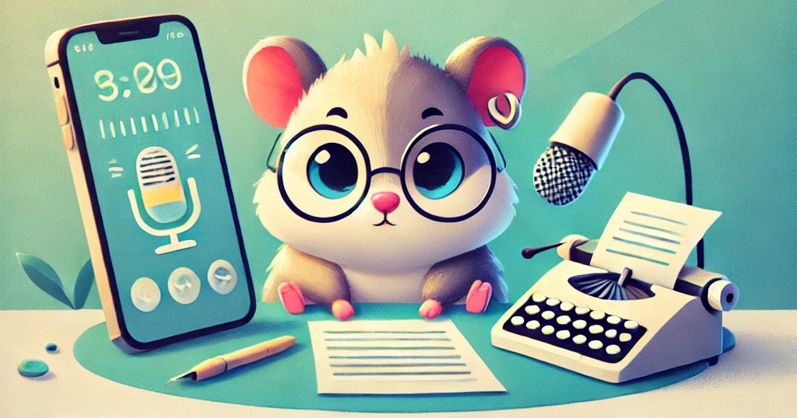

# Hamster Whisper Support Docs (v1.0)

Hamster Whisper offers a streamlined and user-friendly interface for converting audio files into accurate, readable transcripts with the transcribing process operating completely offline. By simply importing audio files in various formats, you can quickly and easily generate transcripts, making the process of turning speech into text hassle-free.

Fast, reliable, and private way to convert speech into text directly on your device!

## Table of Contents
- Known Issues
- Current Features
- Upcoming Features
- Contact & Feedback

### Known Issues:
- (To be listed)

### Current Features:
- Free Lite AI Model: Unlimited transcription with our lightweight AI, perfect for quick, reliable audio-to-text conversion at no cost!
- Enjoy a 7-day free trial to explore our premium AI models with no ads, and upgrade to full access for a super-low monthly fee! If you find the app useful, your support through a subscription will help us continue improving it and keep it sustainable within the App Store ecosystem.
- Offline Transcription: Efficiently convert audio formats into high-quality text using advanced speech recognition. All audio processing and transcription are done on-device, ensuring complete privacy and no need for an internet connection. Note that an internet connection is required for downloading AI models.
- Simple UI: A clean, intuitive interface that lets users import audio files with just a few taps.
- Powered by Whisper: Leverages OpenAI's Whisper model for state-of-the-art speech recognition, ensuring precise and accurate transcriptio

### Use Cases:
- Content Creators: Easily transcribe podcasts, interviews, or videos for editing, captioning, or repurposing content.
- Journalists & Writers: Convert recorded interviews and notes into text to streamline the writing and research process.
- Students & Researchers: Record lectures or meetings and transform them into transcripts for better note-taking and review.
- Accessibility: Assist those with hearing impairments by providing transcripts of audio or video content.

### Upcoming Features:
- Live Streaming: Transcribe audio in real-time as it is being recorded. This feature will allow you to convert streaming audio, such as live podcasts, meetings, or lectures, directly into text on the spot—ideal for users who need instant transcripts without delays.
- On-Device AI Chatbot: Interact with an AI assistant right from within the app to gain deeper insights into your transcriptions. This feature will let you ask the AI questions about the transcript, such as:
    - "Summarize the key points"
    - "Highlight the most important action items."
- Video-to-Text Transcription: Import Video files and transcribe them into text.
- Multilingual Transcription: Support for transcription in multiple languages, making the app accessible to a global audience. Whether you need transcripts in English, Spanish, French, or other languages, the app will allow you to generate accurate text in your preferred language, helping break language barriers.

### Contact & Feedback
For more features requests, ideas or bug report, please contact us via beastob.mark1@gmail.com

Discord Channel will be setup once we have enough users.
